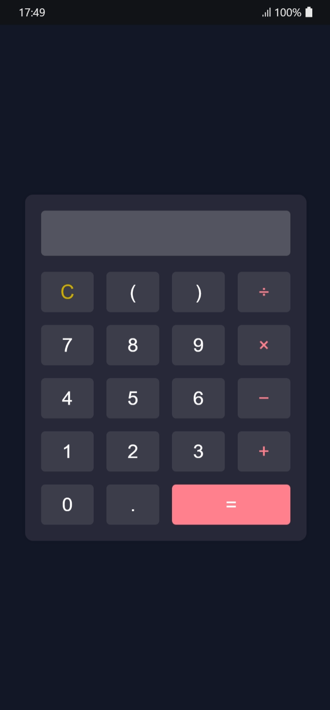

# Calculator

---

## 📌 Overview

A simple and beginner-friendly calculator project demonstrating core frontend skills using HTML, CSS, and JavaScript.

---

## 🖼️ Screenshots



---

## ✨ Features

- Basic arithmetic operations (+, −, ×, ÷)
- Clear (C) reset function
- Real-time expression building
- Responsive layout

---

## 🛠️ Tech Stack

- HTML
- CSS
- JavaScript

---

## 📁 Folder Structure

```bash
calculator/
├── index.html
├── styles.css
├── app.js
└── assets/
```

---

## 📦 Installation & Run

Follow these steps to set up and run the project:

```bash
# Clone the repository
git clone https://github.com/krowey-richmond/calculator.git

# Move into the project folder
cd calculator

# Open in VS Code
code .
```

If it runs in the browser:

- Open `index.html` directly

---

## 📊 Project Status

- Status: Completed
- Version: 1.0

---

## 🧠 What I Learned

- Basic project structure
- How to organize frontend files properly
- DOM manipulation
- Working with clean UI layouts
